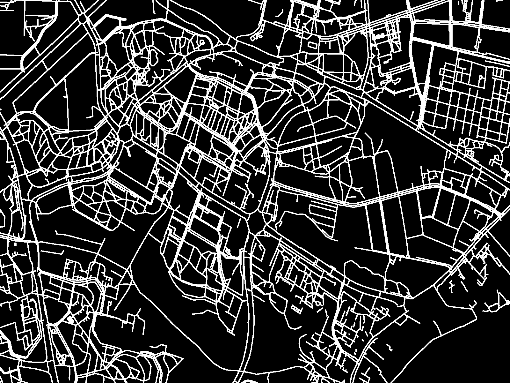

# drogi

## What is this thing?

What I'm aiming to accomplish here is building a tool that'll allow for a quick and straightforward way to tell how a given area's walkability could be improved. In other words: given a map of walkways, where does one add a connection or a set of connections for the greatest improvement in average travel times. Or, still in other words, where to build a sidewalk to get the most bang for your buck.

All in the spirit of new urbanism and reducing car dependancy, concepts about which you can read in other places on the web, should you feel so inclined.

## How is it supposed to work?

#### Getting the data

Thankfully this part is pretty straightforward. At [GeoFabrik GmbH's site](https://download.geofabrik.de/) we can get OpenStreetMap .osm data as convenient, city-sized extracts. But for the purposes of this readme we won't, at least not yet. Instead I manually grabbed an extract of my neighbourhood, it's smaller and in a sense means I get more intimate domain knowledge of what I'm looking at.

#### Processing the data

The file contatining the extract is the map.osm and we're processing it using WayListHandler class. The following calls...

```python
h = WayListHandler("map.osm")
h.apply_file("map.osm", locations=True)
h.draw_walkways(h.way_list)
```
...will result in the following picture being created:




Now what we need to do is represent this data in memory in an even more concise and simple way than what is used in an uncompressed png. For that we're using the [pypng](https://pythonhosted.org/pypng/index.html) module and the MapProcessor class. The result is a list of lists with ones and zeros, denoting walkable and unwalkable spaces, respectively. It looks something like this:

```python
[1, 0, 0, 0, 0, 0, 0, 0, 0, 1]
[1, 0, 0, 0, 0, 0, 0, 0, 0, 1]
[1, 0, 0, 0, 0, 0, 0, 0, 0, 1]
[1, 0, 0, 0, 0, 0, 0, 0, 0, 1]
[1, 1, 0, 0, 0, 0, 0, 0, 0, 1]
[1, 1, 1, 1, 1, 1, 1, 1, 1, 1]
[1, 0, 0, 0, 0, 0, 0, 0, 0, 1]
[1, 0, 0, 0, 0, 0, 0, 0, 0, 1]
```

#### Finding paths

What we're interested in, at least for the time being, is getting some idea about the area's walkable and unwalkable routes. Using the [pathfinding](https://github.com/brean/python-pathfinding) module to walk between a set of random points and summing the resulting paths we get this, here overlaid on the original map:


