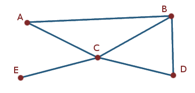
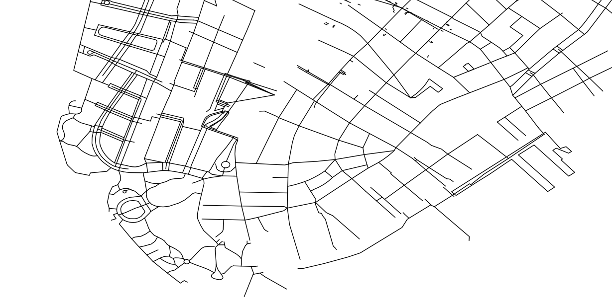
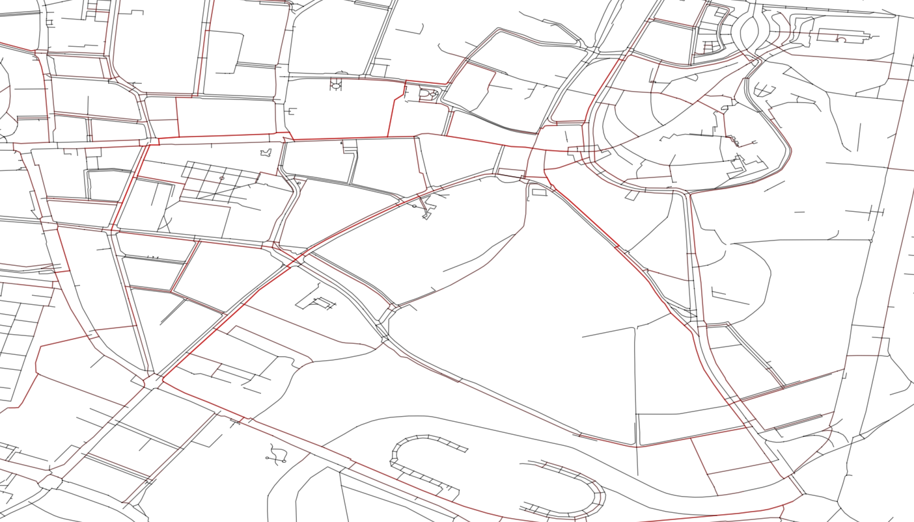
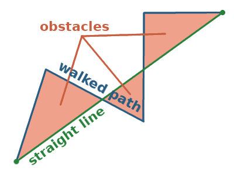
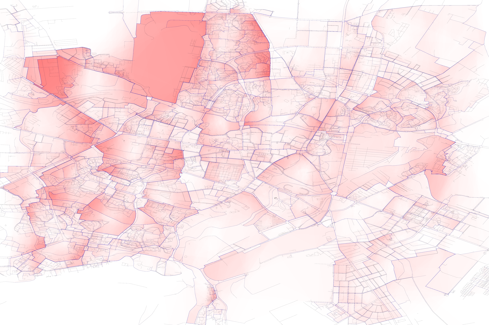

# drogi

## What is this thing?

What I'm aiming to accomplish here is building a tool for analyzing city maps in terms of walkability, driveability, bikeability and so on. Its intended ultimate purpose is generating large amounts of data, as well as creating a simple way to visualize infrastructure trouble spots in a given area.

All in the spirit of new urbanism, urban renaissance, sustainability and reducing car dependency, concepts about which you can read in other places on the web, should you feel so inclined.

## How is it supposed to work?

#### Getting the data

Thankfully this part is pretty straightforward. At [GeoFabrik GmbH's site](https://download.geofabrik.de/) we can get OpenStreetMap .osm data as convenient extracts. But for the purposes of this readme we won't, at least not yet. Instead I manually grabbed an extract of my neighbourhood, it's smaller and in a sense means I get more intimate domain knowledge of what I'm looking at.

#### Processing the data

As I mentioned I intend to use this thing to generate data. For that reason I have decided to design it around a concept of a **WorkRun** which will consist of fetching the data, piece by piece, gluing it together to make a city-sized graph and walking it repeatedly. The patterns that emerge from all the walked paths can then be used to infer deductions.
The WorkRun class is used in the following way:
```python
import drogi
BOUNDS_DICT = {
    "Lublin": (51.1942, 22.4145, 51.3040, 22.6665),
    "lublin_small": (51.2380, 22.5509, 51.2514, 22.5743),
    "new_york": (40.7002, -74.0212, 40.7105, -74.0007),
}
lublin = drogi.WorkRun("Lublin", num_of_trips=0)
```
What's happening inside is the walkable ways from the .osm map get converted into `shapely.LineString` objects and then a graph, represented as a dictionary, is built from those. The representation is pretty standard for Python, the following graph:



Becomes:
```python
graph = {'A': ['B', 'C'],
         'B': ['A', 'C', 'D'],
         'C': ['A', 'B', 'D', 'E'],
         'D': ['B', 'C'],
         'E': ['C']}
```
Only instead of one-letter strings we're using two-tuples of  `(latitude, longitude)`.

#### Visualizing

To see the graph visualized we draw it on a canvas, represented by an instance of the `Canvas` class. The following calls:
```python
new_york = drogi.WorkRun("new_york")
my_canvas = drogi.Canvas(new_york.way_map.bounds_to_fetch)
new_york.way_map.render_on_canvas(my_canvas,
                                 color="black",
                                 aa=True,
                                 linewidth=0.7,
                                 alpha=1)
my_canvas.save("new_york.png", dpi=150)
```
Result in the following image being created:



#### Walking the graph

Let's conduct a yet another WorkRun, this time with some trips going through the area, and a fresh canvas.

```python
new_run = drogi.WorkRun("lublin_small", num_of_trips=100)
new_canvas = drogi.Canvas(bounds)
```
To get some sense of which walkways are more popular than the others we can draw them semi-opaque on top of one another. We'll also tweak the lines so they appear a bit lighter. You can customize it a fair bit as `render_on_canvas` functions use matplotlib's [Line2D](https://matplotlib.org/api/_as_gen/matplotlib.lines.Line2D.html) objects.
```python
new_run.way_map.render_on_canvas(new_canvas,
                                 color="black",
                                 aa=True,
                                 linewidth=0.7,
                                 alpha=0.5)
for trip in new_run.list_of_trips:
    trip.path.render_on_canvas(new_canvas,
                               color="red",
                               aa=True,
                               linewidth=1,
                               alpha=0.1)
new_canvas.save("lublin_with_paths.png", dpi=150)
```
The result will look something like this:



I say "something like this" because origins and destinations of each journey are picked at random, so each run is potentially unique.

#### Finding obstacles

Now let's say we'd want to know the areas which are the biggest offenders in terms of decreasing walkability of the neighbourhood. Such an area could be a river, an unpassable highway or a large factory.
This can be achieved by taking a closer look on the `Obstacle` class, instances of which are kept in a list inside each `Path` object.
Any area that makes the path deviate from a perfectly straight line is considered an obstacle, like so:



Now suppose we shaded these areas for a large number of paths. What we'd get is a map showing the unwalkable bits of the city. Let's try it.

```python

BOUNDS_DICT = {"bigger_test": (51.21, 22.50, 51.28, 22.605)}
new_run = drogi.WorkRun("bigger_test", num_of_trips=20000)
my_canvas = drogi.Canvas(new_run.way_map.bounds_to_fetch)
new_run.way_map.render_on_canvas(my_canvas,
                                 color="black",
                                 aa=False,
                                 linewidth=0.1,
                                 alpha=0.2)
for trip in new_run.list_of_trips:
    trip.path.render_on_canvas(my_canvas,
                               color="blue",
                               aa=False,
                               linewidth=0.1,
                               alpha=0.01)
    for obstacle in trip.path.obstacles:
        obstacle.render_on_canvas(my_canvas,
                                  color="red",
                                  alpha=0.005,
                                  linewidth=0,
                                  edgecolor=None)
my_canvas.save("bigger_test.png")                                  
```
And after 45 minutes on a single core, behold:



With this, we can start to draw some serious conclusions.

#### Coming up in future versions:
* Walking between places of interest, instead of random points
* Layered canvas rendering
* CLI interface through the argparse module
